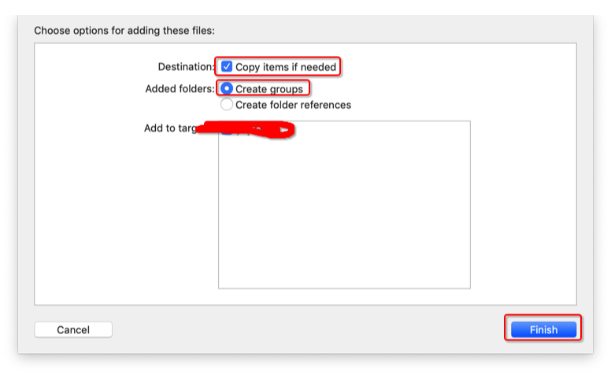
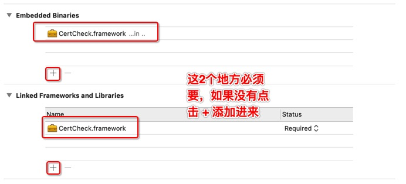
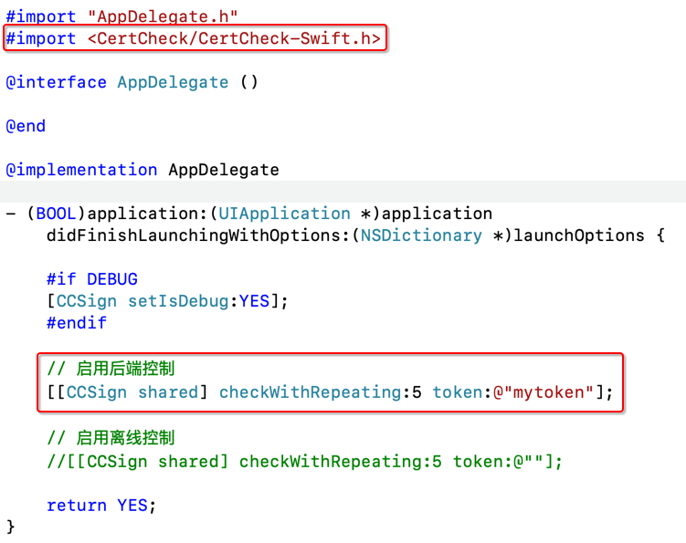
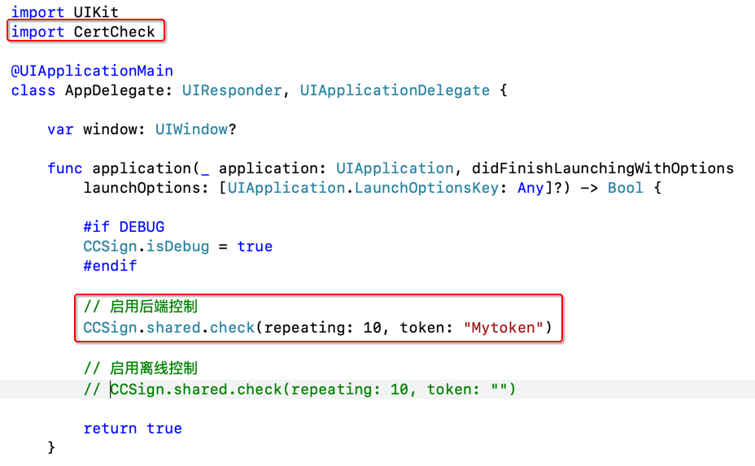
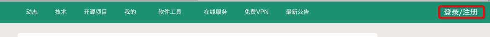
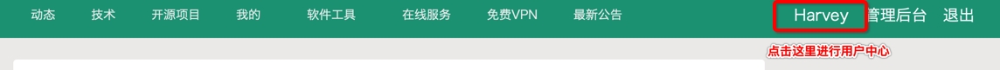
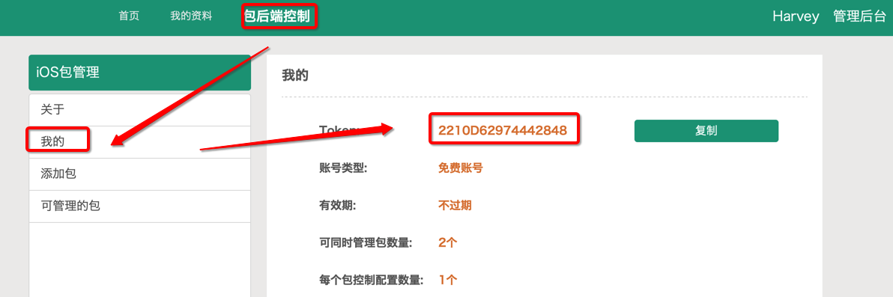

# CertCheck.framework (for iOS)
`只能运行于真机上，切勿在模拟器上使用`

这是一个控制游戏/app使用期限(到设定的时间无法打开app)，或发布弹出公告永久免费的框架，可以全版本或针对某个版本控制，支持离线使用/后端控制，支持Swift、Objective-C，集成非常简单。

**适用场景**

控制游戏/app的过期/使用时间、引导用户去下载/更新游戏/App、发布弹出公告等

## [ [官网](https://www.yaozuopan.top/index.php/863.html) ]

## 集成教程
**1、将CertCheck.framework拖进项目, 在弹出的窗口中选择 `Copy items if needed`**

**2、检查 TARGET -> General**

**3、在应用代理入口AppDelegate写简单代码**

1）Objective-C

2）Swift

完成这三步，你就可以开始编译你的项目了

## 离线设置教程

使用 **[SignTool](./../SignTool)** 进行重签名即可

## 后端控制教程 - 获取token

**1、注册账号**
打开 [me88.top](https://me88.top) 并点击导航最右边 `登录/注册` 按钮进行注册账号

**2、成功登陆账号后进入用户中心**

**3、在用户中心选择 `包后端控制`, 即可查看token**

在`包后端控制`可管理包以及控制配置的添加、修改等操作。
