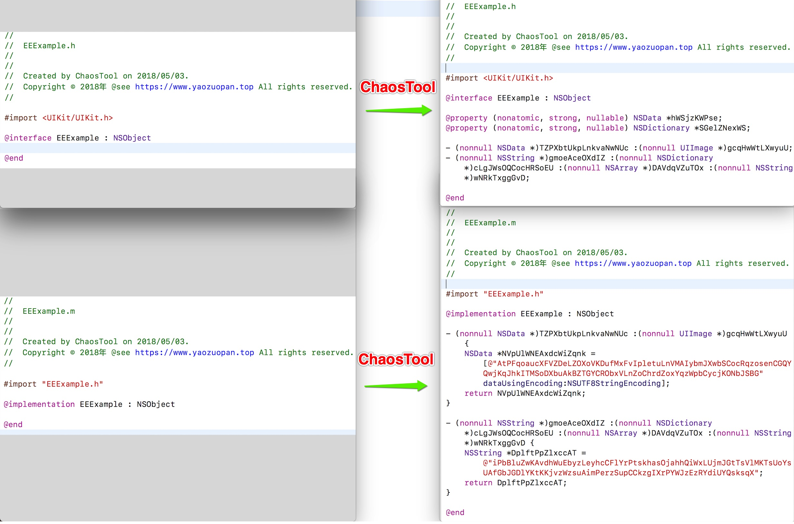
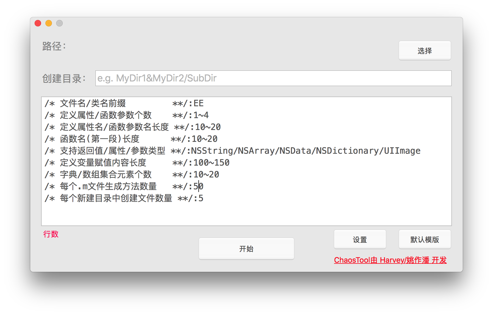

# ChaosTool
最近在H5游戏项目中需要添加垃圾代码作混淆，提高过审机率。手动添加太费时费力，在网上并没有找到合适的比较好的工具，就自己动手写了一个垃圾代码添加工具，命名为ChaosTool。

**特点**

- 自动定义变量/函数/属性
- 自动实现函数体
- 自动识别插入位置
- 自动创建/并编写类文件(.h/.m)
- 自动创建文件夹
- 无须手动反复Copy，一键生成，几秒钟可生成上万代码
- 模版可根据需要更改
- 不影响原有的功能

## [ [官网](https://www.yaozuopan.top/index.php/71.html) ]

## ChaosTool安装环境
- macOS 10.12+ (不支持Windows)

## ChaosTool教程

**效果看看**

### 使用说明
**ChaosTool界面**

**路径**
这是必须的。如果选择是目录，则对目录下的所有.m文件进行添加垃圾代码；如果选择的是文件路径则只对该文件进行添加垃圾代码。

**创建目录**
这是可选的(对选择目录有效)。创建多个目录使用 '&' 拼接，如果不需要在选择的路径中创建新目录，可保持默认。

ChaosTool自动会往新目录自动创建5个新类并自动定义并实现函数(文件数量可在模版修改)。
添加完垃圾代码需要手动添加新建的目录及里面的文件到项目中，切记，切记，切记。

**模版**
可根据需要修改值，但是模版框中的数据格式不能修改，否则无法解析模版。

**开始按钮**
点击后就开始解析模版并执行添加垃圾代码操作，不可撤销，建议执行前备份代码。

**默认模版按钮**
如果不小心更改了模版中的数据格式，导致无法解析，可使用此按钮恢复默认模版