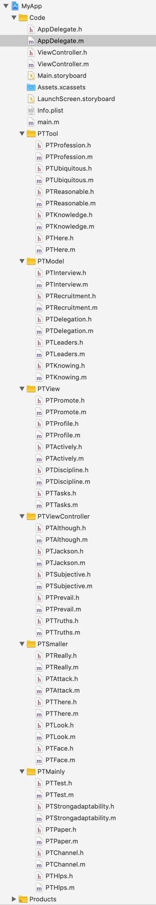

# ProjectTool
这是自动写白包工具，秒级别写H5游戏壳包，可视化操作，极易使用，支持Swift、Objecive-C双语言

## [ [官网](https://www.yaozuopan.top/index.php/73.html) ]

这是一个白包目录示例

## ProjectTool安装环境
- macOS 10.13+ (不支持Windows)
- Ruby
- xcodeproj (Ruby开源库)

## [ [官网](https://www.yaozuopan.top/index.php/73.html) ]
