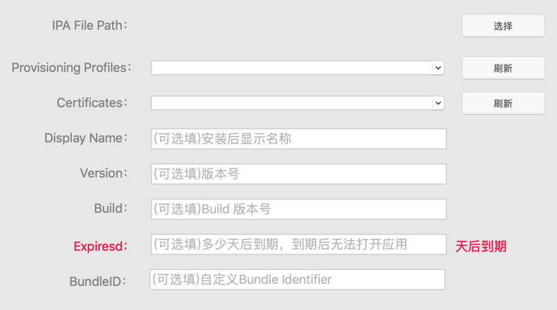

# SignTool
有时候由于某些原因我们需要换证书提审，特别是游戏行业(经常需要换证书)。当我们需要换证书时，如果重新制作证书然后再发给CP打包，这个流程是很费时间的（因为CP不仅仅对接你们这一个渠道，重新打包可能需要排期）。其实我们只要使用新证书对ipa文件重新签名就可以了，无须再让CP重新打包。只是手动去签名有些繁琐，我自己就开发个签名工具(SignTool)去对ipa文件进行快速签名。

## [ [官网](https://www.me88.top/index.php/74.html) ]

## SignTool安装环境
- macOS 10.12+ (不支持Windows)

## SignTool教程

**IPA File Path**

这是必须。选择ipa文件路径

**Provisioning Profiles**

SignTool会自动加载系统中的 Provisioning Profiles
如果是打开SignTool后才安装的Provisioning Profiles，这时你需要点击刷新按钮，才能出现在列表中，你才可以选择它。

**Certificates**

SignTool会自动加载系统中的 Certificates
如果是打开SignTool后才安装的Certificates，这时你需要点击刷新按钮，才能出现在列表中，你才可以选择它。

**Display Name**

选填。App安装后显示的名称，如果需要则填写

**Version**

选填。App的版本号，如果需要则填写

**Build**

选填。App的build版本号，如果需要则填写

**Bundle Identifier**

选填。自定义Bundle Identifier

**执行签名**

点击该按钮后则开始进行签名，不可取消。