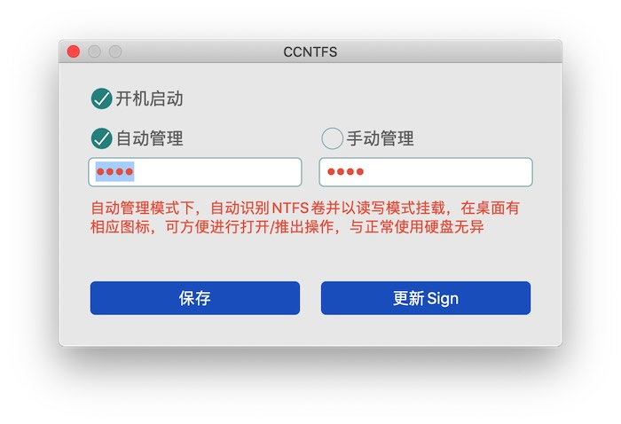
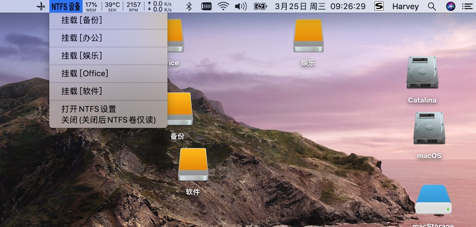
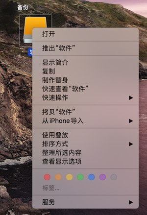

# CCNTFS

在 macOS 中完全读写、修改、访问Windows NTFS硬盘的文件，无须额外的驱动(原生驱动)更稳定，安装后进行简单设置即可高速传输外接NTFS硬盘文件，`可全程离线使用`，保障您数据的安全性

macOS本就支持NTFS，由于微软的限制，苹果将其关闭，但并没有删除；开发人员通过命令即可开启，但是对于小白来说还是有困难

`Paragon NTFS For Mac` 和 `Tuxera NTFS for Mac`并非使用原生驱动，有时候在传输数据会中断，特别是传大文件时，另外这两款软件是收费的。

## CCNTFS 安装环境
- macOS 10.12+ (不支持Windows)

## 使用教程

安装 CCNTFS 后进行简单设置后重启电脑即可

CCNTFS 支持手动管理和自动管理两种模式，自动管理需要用户管理权限(需要Mac设备开机密码)

### 手动管理
由于权限问题，该模式下以读写模式挂载NTFS卷时桌面无图标，无法从桌面进行打开/推出操作，需要手动从状态栏进挂载/打开/推出操作，另外不支持标签名`含有空格`的NTFS卷

### 自动管理
当有设备插入Mac时，自动识别NTFS卷并以读写模式挂载，当桌面 NTFS卷图标闪一下就表示已完成读写模式挂载(从第一次出现图标起，到自动完成挂载最长只需2.5秒)，此时对桌面的NTFS卷可进行打开/读写/推出操作，与正常使用硬盘无异。

在桌面右键可推出NTFS卷

