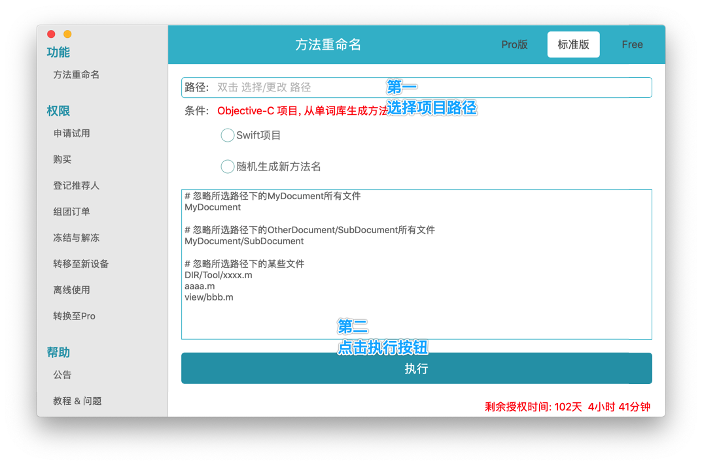

# CCNamer
项目方法名/类名/文件名修改器，采用链式解析头文件，代码模型预判，减少误改的机率，替换速度更快；可以解析整个项目大多数类的方法，可视化操作，傻瓜式操作，一键批量修改，引用处自动修改，效率高，省时省力，修改后的方法名规范，提高过审机率，支持Swift(未来支持)、Objecive-C双语言。对于马甲包来说，改掉项目大多数的方法名,效果远比混淆要好的多，M-Renamer马甲包的福音。

## [ [官网](https://www.me88.top/index.php/875.html) ]

## 安装环境
- macOS 10.13+ (不支持Windows)

# 教程

